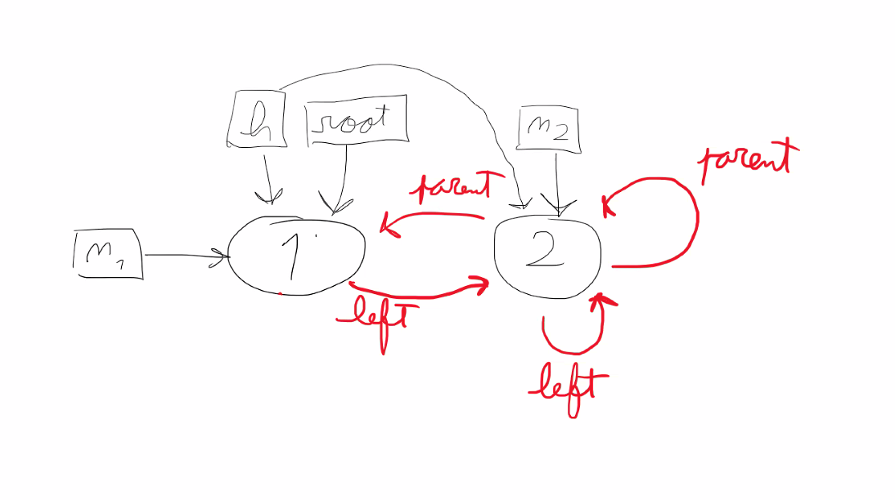

# Practica 1

#### Autor: Carlos Giudice

# Ejercicio 1

| Nodo n      | IN[n]                                | OUT[n]       |
| ----------- | ------------                         | -----------  |
| 1           | -                                    | $\emptyset$ |
| 2           | $\emptyset$                          | $\{[x, 2]\}$ |
| 3           | $\{[x, 2]\}$                         | $\{[x, 2], [y, 3]\}$ |
| 4           | $\{[x, 2], [y, 3], [x, 6], [y, 5]\}$ | $\{[x, 2], [y, 3], [x, 6], [y, 5]\}$ |
| 5           | $\{[x, 2], [y, 3], [x, 6], [y, 5]\}$ | $\{[x, 2], [y, 5], [x, 6]\}$ |
| 6           | $\{[x, 2], [y, 5], [x, 6]\}$         | $\{[x, 6], [y, 5]\}$ |
| 7           | $\{[x, 2], [y, 3], [x, 6], [y, 5]\}$ | - |

# Ejercicio 2

\begin{large}
\begin{center} 
$IN[n] = \bigcup_{n' \in pred(n)} OUT[n']$
\end{center} 
\end{large}

\begin{large}
\begin{center} 
$OUT[n] = (IN[n] - KILL[n]) \cup GEN[n]$
\end{center} 
\end{large}

# Ejercicio 3

| Nodo n      | IN[n]        		| OUT[n]      |
| ----------- | ------------------- | ----------- |
| 1           | -           		| $\{b - a\}$ |
| 2           | $\{b - a\}$  		| $\{b - a\}$ |
| 3           | $\{a - b, b - a\}$  | $\{a - b\}$ |
| 4           | $\{b - a\}$         | $\emptyset$ |
| 5           | $\emptyset$         | $\{a - b\}$ |
| 6           | $\{a - b\}$         | $\emptyset$ |
| 7           | $\{a - b\}$         | $\emptyset$ |
| 8           | $\emptyset$         | -           |

# Ejercicio 4

\begin{large}
\begin{center} 
$OUT[n] = \bigcup_{n' \in pred(n)} IN[n']$
\end{center} 
\end{large}

\begin{large}
\begin{center} 
$IN[n] = (OUT[n] - KILL[n]) \cup GEN[n]$
\end{center} 
\end{large}

# Ejercicio 5

b) 

| Nodo n      | IN[n]        		| OUT[n]      		|
| ----------- | ------------------- | ----------------- |
| 0           | -           		| {pid} 	  		|
| 1           | {pid}          		| {pid, j}    		|
| 2           | {pid, j}           	| {pid, j, i} 		|
| 3           | {pid, j, i}			| {pid, k, j, i} 		|
| 4           | {pid, k, j, i}		| {pid, k, j} 		|
| 5           | {pid, k, j}         | {pid, k, h} 		|
| 6           | {pid, k, h} 		| {pid, k, h} 		|
| 7           | {pid, k} 			| {pid, k, h} 		|
| 8           | {pid, k, h}    		| {answer, pid, k} 	|
| 9           | {answer, pid, k} 	| $\emptyset$ 		|
| 10          | $\emptyset$    		| - 				|

# Ejercicio 6

En $available \ expressions \ analysis$ vamos a considerar que se mata toda expresión que tenga algún operando overrideado por la operación actual. Se genera la expresión actual.

| Nodo n      | IN[n]        		| OUT[n]      		|
| ----------- | ------------------- | ----------------- |
| 0           | -           		| $\emptyset$  		|
| 1           | $\emptyset$    		| $\emptyset$  		|
| 2           | $\emptyset$    		| $\emptyset$  		|
| 3           | $\emptyset$    		| $\emptyset$  		|
| 4           | $\emptyset$    		| {m[i]} 	  		|
| 5           | {m[i]}         		| $\emptyset$  		|
| 6           | $\emptyset$   		| $\emptyset$ 		|
| 8           | $\emptyset$    		| $\emptyset$		|
| 9           | $\emptyset$			| -		 	  		|

Notas: 
- considero que bar(M, a ) no es una expresión, porque su output no se asigna a ninguna variable. 
- considero que M es una constante definida fuera de foo.
- en Live Variables no pasa como en Available Expressions que si se usa la variable en el mismo nodo en el que se asigna se ignora.

# Ejercicio 7

|             | Forward    				| Backward     			|
| ----------- | ----------------------- | ---------------------	|
| May         | Reaching definitions	| Live variables		|
| Must        | Available Expressions   | Very busy expressions	|

# Ejercicio 8

{height=210px}

#### Explicación

1. Se crea var N1 apuntando a Nodo_1
2. Se ignora n1.data porque se le asigna un primitivo
3. Se crea root y se lo apunta a Nodo_1
4. Se crea h y se lo apunta a Nodo_1 (porque root apunta solo a Nodo_1)
5. Se ignora la línea h = h.left, porque h todavía no tiene ningún path con label left desde ninguno de los nodos a los que apunta
6. Se crea var N2 apuntando a Nodo_2 (2do alloc site)
7. Se ignora n2.data porque se le asigna un primitivo
8. Se coloca una flecha de Nodo_1 a Nodo_2 con label left
9. Se coloca flecha de Nodo_2 a Nodo_1 con label parent (porque n2 apunta solo a Nodo_2 y h apunta solo a Nodo_1)

#### === Hasta acá la primera iteración ===

10. Del primer if no se modifica nada, pero cuando llegamos a la línea h = h.left pasa algo. Agregamos una flecha de Nodo_1 a Nodo_2 (porque h.left apunta a Nodo_2)
11. La siguiente línea que cambia algo es h.left = n2, donde ahora tenemos que agregar flechas de Nodo_1 a Nodo_2 con label left (esta ya está de la iteración anterior), y flecha de Nodo_2 a Nodo_2 con label left
12. Por razonamiento análogo, acá agregamos flecha parent que loopea sobre Nodo_2

# Ejercicio 9

Las siguientes reglas deben ser especificadas como hechos ya conocidos sobre el programa:

| kill(n:N, v:V) 
| gen(n:N, v:V)
| next(n:N, m:N)

Defino las siguientes reglas:

| in(n, v) :- out(n, v), !kill(n, v)
| in(n,v) :- gen(n, v)
| out(n, v) :- next(n, m), in(m, v)

