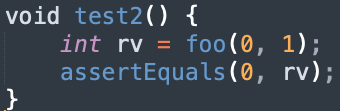
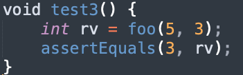

# Practica 2

#### Autor: Carlos Giudice

# Ejercicio 1

DUDA: como pido que A esté inicializado? Está bien pedir que sea distinto de null?

precondición: $A \neq Null \land B \neq Null \land B.length \leq A.length$

# Ejercicio 2

{height=50px}

# Ejercicio 3

{height=50px}

# Ejercicio 4

Si reemplazamos cualquiera de las desigualdades del primer if por el signo ">" (lo cual llamamos relational operator replacement) y escribimos un test que checkea la correcta detección de un triángulo, veremos que el mutante devuelve el número 4. Esto es una respuesta incorrecta.

# Ejercicio 5

| root | N0.left | N0.right | N1.left | N1.right | N2.left | N2.right |
| ---- | ------- | -------- | ------- | -------- | ------- | -------- |
| N0   | NULL	 | N1		| N2	  | NULL	 | NULL    | NULL	  |
| N0   | N1	     | NULL     | NULL	  | NULL	 | NULL    | NULL	  |
| N0   | N1	     | NULL     | NULL	  | N2  	 | NULL    | NULL	  |

#### Explicacion:

- Korat expande el último campo accedido en la funcion de invariante (en el caso el nodo derecho del último nodo) o de ser imposible hace backtracking.
- El árbol que nos dan en la consigna ya tiene tres nodos, con lo cual no se puede agregar otro nodo.
- El árbol que nos dan en la consigna tiene a N2 como hijo izquierdo de N1 y N1 como hijo derecho de N0.
- En la función de invariante se accede primero a $current.left$ y luego a $current.right$
- Podemos decir que ya se exploró la posibilidad de poner a N2 como hijo derecho de N1.
- Entonces el campo accedido previamente es $N0.left$ y ahí es donde ponemos N2. DUDA: es aceptable que no quede monotono?
- Luego, volvemos a hacer backtracking (eliminando N2) y ponemos a N1 como hijo izquierdo de N0. 

