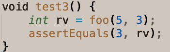
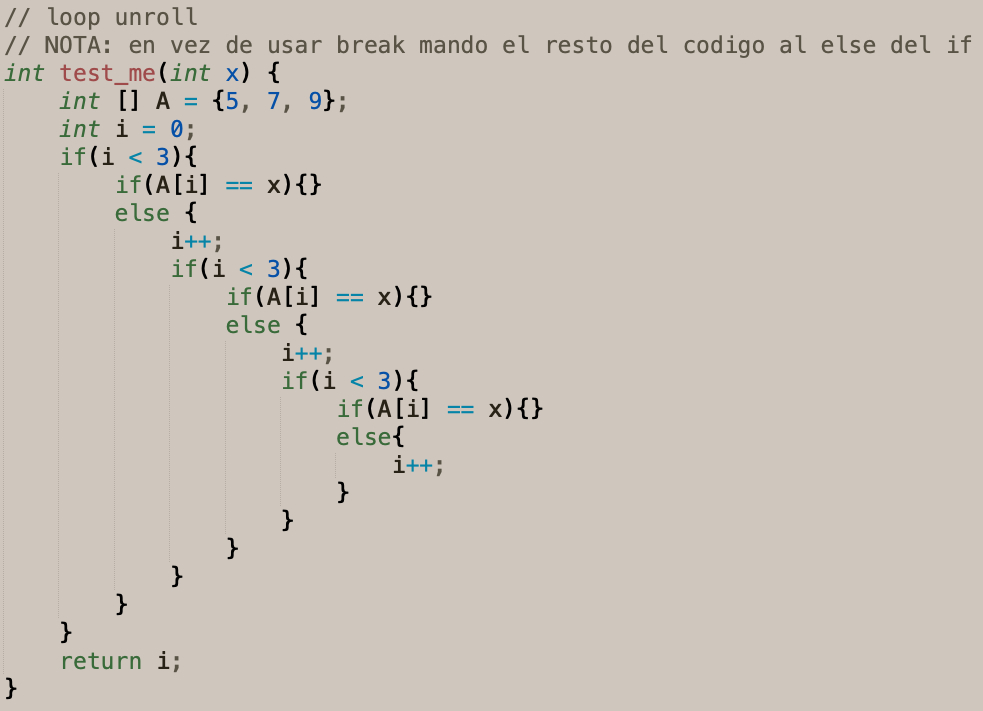
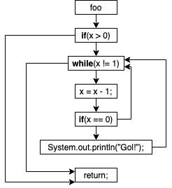
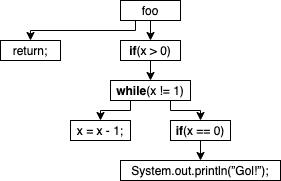

# Practica 2

#### Autor: Carlos Giudice

# Ejercicio 1

DUDA: como pido que A esté inicializado? Está bien pedir que sea distinto de null?

precondición: $A \neq Null \land B \neq Null \land B.length \geq A.length$

# Ejercicio 2

{height=50px}

# Ejercicio 3

{height=50px}

# Ejercicio 4

Si reemplazamos cualquiera de las desigualdades del primer if por el signo ">" (lo cual llamamos relational operator replacement) y escribimos un test que checkea la correcta detección de un triángulo, veremos que el mutante devuelve el número 4. Esto es una respuesta incorrecta.

# Ejercicio 5

| root | N0.left | N0.right | N1.left | N1.right | N2.left | N2.right |
| ---- | ------- | -------- | ------- | -------- | ------- | -------- |
| N0   | NULL	 | N1		| N2	  | NULL	 | NULL    | NULL	  |
| N0   | N1	     | NULL     | NULL	  | NULL	 | NULL    | NULL	  |
| N0   | N1	     | NULL     | NULL	  | N2  	 | NULL    | NULL	  |

\newpage 

# Ejercicio 6

# Ejercicio 7

1. 
|   bt = BinaryTree(NULL);

2. 
|   bt = BinaryTree(NULL);
|	bt.removeRoot();

3. 
|   n1 = Node(NULL, NULL);
|   n2 = Node(n1, n1);
|   bt = BinaryTree(NULL);

- Las secuencias dos y tres seran descartadas por arrojar errores en su ejecución.

- La secuencia uno puede o no ser útil para evidenciar algún error en el código a testear.

		- En caso afirmativo será enviada al usuario como información para arreglar el código.

		- Si no rompe el código, será enviada al conjunto de componentes donde será un posible elemento a usar a la hora de crear estructuras mas complejas

\newpage 

# Ejercicio 8

{height=300px}

{height=300px}

| x | cond de ruta enviada 					  |
| - | --------------------------------------- |
| 1 | $5 \neq x \land 7 \neq x \land 9 = x$	  |
| 9 | $5 \neq x \land 7 = x$ 				  |
| 7 | $5 \neq x$ 			 				  |

\newpage 

# Ejercicio 9

{height=300px}

{height=200px}

- Asumiendo un valor de K=5, la distancia del branch L1 para el input x = -15 es:
	
	- $L1-true = a > b \ ? \ 0 : (b - a) + K = -15 > 0 \ ? \ 0 : (0 - (-15)) + 5 = (0 - (-15)) + 5 = 20$

	- $L1-false = a \leq b \ ? \ 0 : (a - b) = -15 \leq 0 \ ? \ 0 : -15 - 0 = 0$

- Asumiendo un valor de K=5, la distancia del branch L4 para el input x = -10 es:

	- $L4-true = abs(-10 - 0) = 10

	- $L4-false = a != b ? 0 : K = -10 != 0 ? 0 : 5 = 0

