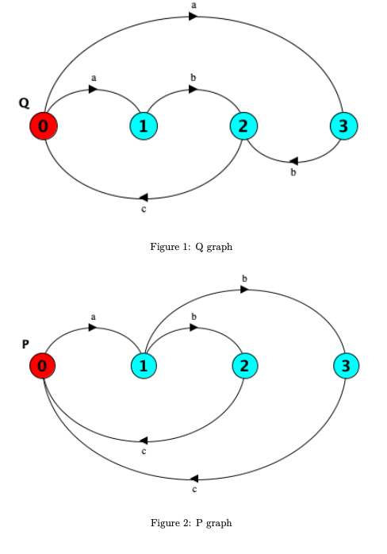

# Taller 5

#### Autor: Carlos Giudice

# Ejercicio 1

{height=600px}

\newpage

#### Punto fijo para bisimulación fuerte (\~)

\\

| 	\~0 = {
|	(0, 0), (0, 1), (0, 2), (0, 3),
| 	(1, 0), (1, 1), (1, 2), (1, 3),
| 	(2, 0), (2, 1), (2, 2), (2, 3),
| 	(3, 0), (3, 1), (3, 2), (3, 3)
|	}

| 	\~1 = {
|	(0, 0),                        
| 	        (1, 1),
| 	                (2, 2), (2, 3),
| 	        (3, 1)
|	}

| 	\~2 = {
|	(0, 0),                        
| 	        (1, 1),
| 	                (2, 2), (2, 3),
| 	        (3, 1)
|	}

Como \~1 y \~2 son iguales, paramos ahí, habiendo encontrado una relación de bisimulación fuerte.

